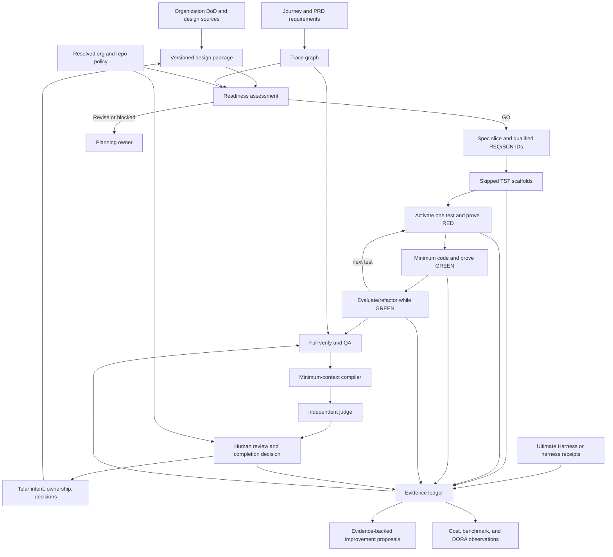

# SpecSafe Evidence Chain and Readiness Extension

Status: Proposed — design only, not implemented
Date: 2026-08-23
Depends on: `docs/SPECSAFE-CANONICAL-WORKFLOW.md`

Canonical cross-project boundary: the workspace decision at
`Telar/docs/architecture/adrs/ADR-023-separate-delivery-systems-behind-contracts.md`
keeps SpecSafe repository-local and makes this assurance kernel proposed, not a
Run Control. This document remains canonical for the SpecSafe-side design.

## Decision summary

SpecSafe should remain a repo-local planning, TDD, verification, and QA framework. It should not
become a run controller, deployment system, financial system, enterprise design repository, or
work-management authority.

The next product slice should make the existing workflow verifiable. A small assurance kernel
should resolve versioned design inputs, validate traceability, evaluate organizational and
repo-local completion policy, and produce evidence receipts. Runtime systems and enterprise tools
integrate through narrow adapters; they retain their own authority.

The proposed MVP adds one read-only assessment surface and extends canonical workflows and
templates. It does not add execution scheduling, deployment, model routing, or autonomous policy
changes.

## Current truth and gaps

| Area | Current capability | Gap to close |
|---|---|---|
| CLI | Exposes `init`, `install`, `update`, and `doctor`; doctor checks configuration, lifecycle directories, and installed tool adapters. | No semantic readiness, traceability, or evidence assessment surface. |
| Planning | PRD maps user journeys to functional requirements; UX and architecture consume the planning chain; readiness checks cross-artifact coherence, dependencies, slicing, and open questions. | Journeys and requirements have no canonical cross-document IDs; readiness has no mandatory versioned design-package input. |
| User stories | The preferred unit is a small spec slice, not an epic or broad story. | No explicit decision on whether a team may retain stories or how stories map to journeys and requirements. |
| Design | UX covers flows, states, accessibility, and tokens. Architecture covers system context, components, data, interfaces, deployment target, security, reliability, and ADRs. | No required, versioned package covering process, structural, data, sequence, interface, deployment/trust/cost, and mockup evidence. |
| SPEC | Specs use `REQ-*`, acceptance criteria, scenarios, technical approach, test strategy, implementation phases, and a decision log. | PRD requirements, spec requirements, and scenarios are conventionally related but not machine-verifiable. |
| TEST | Every scenario becomes one skipped scaffold with GIVEN/WHEN/THEN comments. | Tests lack stable trace IDs and generation receipts. |
| CODE | Activates one test, proves RED, writes minimum code, proves GREEN, evaluates refactor, and repeats. | RED/GREEN/refactor evidence, requested/actual model, context selection, and fallback are not recorded canonically; code standards are implicit in repo conventions. |
| VERIFY and QA | Run tests, apply coverage and requirement/scenario checks, generate a QA report, and loop back on failure. | Coverage is hard-coded, evidence links are descriptive, and the verifier has no minimum-context or independence contract. |
| COMPLETE | Requires an explicit human approval after QA GO. | No resolved Definition of Done or signed waiver record is attached to the approval. |
| Adapters | `ToolAdapter` transforms canonical skills into harness-specific files. | Distribution adapters do not normalize runtime receipts, and should not be stretched to do so. |

## Product boundaries

### SpecSafe owns

- canonical workflow semantics for planning, readiness, spec slices, TDD, verification, QA, and
  human completion;
- stable identifiers and allowed trace edges inside a repository;
- the manifest contract for versioned design inputs;
- deterministic policy resolution and gate evaluation;
- evidence normalization, validation, redaction rules, and repo-local receipts;
- a minimum-context review envelope and evidence-backed improvement proposals.

### SpecSafe does not own

- enterprise process or architecture authoring;
- the organizational Definition of Done itself;
- prompt execution, model routing, retries, fallback selection, or agent scheduling;
- project or portfolio lifecycle authority;
- source control hosting, CI execution, deployment, rollback, or incident response;
- price books, invoices, budgets, benchmark leaderboards, or DORA calculations.

Those systems provide inputs or consume observations. SpecSafe only decides whether a local
planning or development checkpoint satisfies the policy and evidence available to it.

## Identity and trace model

### Canonical identifiers

| Node | Identifier | Notes |
|---|---|---|
| User journey | `JRN-001` | Required for user-facing PRD flows. |
| User story | `US-001` | Optional projection; never the only parent of a requirement. |
| Functional requirement | `FR-001` | PRD-level behavior. |
| Non-functional requirement | `NFR-001` | PRD-level measurable quality constraint. |
| Spec slice | `SPEC-YYYYMMDD-NNN` | Existing lifecycle identifier. |
| Spec requirement | `<SPEC-ID>#REQ-001` | Qualified to avoid collisions across specs. |
| Scenario | `<SPEC-ID>#SCN-001` | Stable ID independent of scenario title. |
| Test | `<SPEC-ID>#TST-001` | Stored in test metadata or a sidecar map, not inferred only from a test title. |
| Code evidence | `CODE:<tree-digest>:<path>#<symbol-or-region>` | Points to reviewed code without spreading requirement comments through production files. |
| Evidence | `<SPEC-ID>#EVD-001` | Test output, review, screenshot, benchmark, or other immutable receipt. |
| Decision | `<SPEC-ID>#DEC-001` | Human, agent, readiness, QA, or waiver decision. |

IDs are stable within their artifact. Titles may change without changing identity. Cross-artifact
references use qualified IDs.

### User-story decision

User stories remain optional. The canonical product model stays journey-first and requirement-first:

```text
JRN -> FR/NFR
JRN -> US -> FR/NFR    # optional team view
```

If stories exist, every `US-*` must reference at least one `JRN-*` and every story acceptance
criterion must resolve to one or more `FR-*`, `NFR-*`, or spec `REQ-*` nodes. If stories do not
exist, requirements map directly to journeys. Readiness must reject orphan stories and requirements,
but it must never require a team to create stories merely to satisfy SpecSafe.

### Required trace edges

```text
JRN -> (US?) -> FR/NFR -> SPEC -> REQ -> SCN -> TST -> CODE -> EVD -> DEC
```

| Edge | MVP rule |
|---|---|
| Journey to requirement | Every P0/P1 functional requirement resolves to at least one journey; system-only requirements carry an explicit `not-user-facing` rationale. |
| Story to journey/requirement | Validated only when stories exist. |
| PRD requirement to spec | Every spec declares the `FR-*` and `NFR-*` nodes it advances. |
| Spec requirement to scenario | Every `REQ-*` has happy, edge, and error scenarios with stable IDs. |
| Scenario to test | Exactly one primary scaffold per scenario in the current workflow; additional tests may reference the same scenario. |
| Test to code | Derived from executed test evidence, coverage or instrumentation when available, and the reviewed change set; production code is not required to carry inline requirement IDs. |
| Test/code to QA evidence | QA records the exact command, result digest, relevant artifacts, and trace nodes evaluated. |
| QA evidence to decision | Completion records the human decision, resolved policy version, judge receipt, and any approved waivers. |

The graph checker verifies node existence, allowed edge types, required coverage, duplicate IDs, and
dangling references. Semantic correctness remains a readiness, judge, and human-review concern.

## Mandatory versioned design package

Every readiness invocation should require a design-package manifest. A lightweight profile may mark
categories non-applicable for trivial work, but the omission remains explicit and reviewable.
SpecSafe validates and snapshots references; it does not become the authoring or enterprise
repository for the designs.

### Package categories

| Category | Accepted evidence | Readiness question |
|---|---|---|
| Process | BPMN or equivalent process model | Are actors, handoffs, exceptions, and manual steps explicit? |
| Structure | UML context/component/class/state models or equivalent | Are responsibilities, dependencies, and states coherent? |
| Data | Domain model, ERD, schema contract, retention/classification notes | Does the data model support journeys, requirements, trust, and lifecycle rules? |
| Sequences | Sequence diagrams for critical and failure paths | Are ordering, retries, timeouts, idempotency, and failure ownership explicit? |
| Interfaces | API/event/file/CLI contracts | Are inputs, outputs, invariants, errors, compatibility, and ownership explicit? |
| Deployment | Topology and environment model | Is the intended runtime shape understood without asking SpecSafe to deploy it? |
| Trust | Threat/trust boundaries, identity, authorization, data exposure | Are security assumptions and review obligations explicit? |
| Cost | Cost drivers, limits, and measurement source | Are cost constraints visible while the financial system remains authoritative? |
| Experience | Versioned mockups or prototypes plus UX flows/states | Can readiness reconcile intended behavior with PRD and architecture? |

The manifest is mandatory; category applicability is policy-driven. A missing applicable category is
a readiness failure. A non-applicable category requires a rationale, owner, and human approval rather
than a silent omission.

Each manifest entry records an ID, category, owner, source path or immutable URI, version, content
digest, status, applicability, related requirements, and supersession link. External enterprise
artifacts stay external. A readiness decision records the exact resolved manifest digest so later
verification can reproduce what the team meant by “ready.”

## Definition of Done and gate policy

### Ownership and precedence

The organizational Definition of Done is an input owned by the organization. A repository owns its
local criteria. SpecSafe owns only deterministic resolution and evidence-backed evaluation.

```text
organization baseline
  -> organizational profile selected by the repo
  -> repo-local additions or stricter parameters
  -> explicit, time-bounded human waiver
```

A repo may tighten an organizational gate. It may disable or weaken one only when the organization
marks that gate optional, or when an authorized waiver names the gate, reason, approver, expiry, and
compensating evidence.

### Parameter model

Each gate has:

- a stable gate ID;
- `enabled: yes | no`;
- `required: yes | no`;
- typed parameters, such as a coverage threshold or required design categories;
- an evidence predicate;
- an owner and policy version;
- a failure severity and remediation hint.

The MVP supports declarative yes/no activation and typed parameters only. It rejects arbitrary shell
expressions and embedded policy code. Project commands remain repo-local inputs whose captured
results can satisfy predicates.

Recommended MVP gate families are trace completeness, design-package completeness, tests passing,
coverage threshold, lint/typecheck/build commands when configured, security review, accessibility
review, independent judge, human approval, and waiver validity. Defaults must no longer hard-code a
universal 80% coverage rule.

## Deep modules and interfaces

### 1. Assurance kernel

The assurance kernel is the deep module that hides identifier resolution, graph construction,
policy merging, artifact verification, evidence correlation, and verdict rules.

Its external interface stays small:

```text
record(event) -> receipt
assess(checkpoint, subject, policyRef, designPackageRef) -> assessment
export(subject, observationKinds) -> observations
propose(subject, evidenceWindow) -> improvementProposals
```

`checkpoint` is one of readiness, test, code, verify, QA, or complete. `subject` is a project or
qualified spec ID. The interface returns results and never schedules the next workflow step.

### 2. Design package resolver

`resolve(manifestRef) -> immutable design snapshot + findings`

The implementation resolves repo-local files and external immutable references, verifies digests,
normalizes artifact metadata, handles approved non-applicability, and exposes one snapshot to the
assurance kernel. The seam has two real adapters from the start: repo-local artifact source and
external versioned artifact source.

### 3. Minimum-context compiler

`compile(reviewPurpose, subject, evidenceSnapshot) -> review envelope`

The compiler includes only the requirements, scenarios, design snapshot, policy clauses, tests,
change set, and evidence needed for the review purpose. It records what was included and which
context classes were deliberately excluded. It excludes secrets, unrelated files, full transcripts,
hidden reasoning, and prior-agent persuasion by default.

### 4. Runtime receipt adapters

`normalize(providerReceipt) -> evidence events`

This is distinct from the existing `ToolAdapter`, which distributes canonical skills and rules.
Runtime adapters normalize requested and actual model, fallback, effort, actor/agent, instruction
reference, included artifact digests, excluded context classes, decisions, test commands, results,
and provider run IDs. Ultimate Harness and at least one generic harness receipt provide two real
adapters; vendor-specific routing remains outside SpecSafe.

### Internal ledger contract

The kernel maintains an append-only, tamper-evident ledger of normalized events. Each event records:

- human actor role or approved pseudonymous identity;
- agent and harness identity;
- instruction reference and digest, not the full prompt by default;
- requested model, actual model, fallback reason, and effort;
- artifact references and digests included in context;
- excluded context classes and rationale;
- decisions and linked trace IDs;
- tests, commands, result digests, and evidence references;
- parent event, timestamp, and previous-event digest.

The ledger is not a transcript store. Credentials, raw private context, hidden reasoning, and
unredacted provider payloads are forbidden.

## TDD and code standards

The canonical TDD sequence remains:

```text
skipped scaffold -> activate one test -> prove RED -> minimum code -> prove GREEN
  -> evaluate/refactor while GREEN -> full regression suite -> next test
```

The evidence chain adds a receipt for scaffold creation, RED, GREEN, refactor decision, final suite,
and any approved test change. A passing test without a preceding RED receipt is a finding. A resume
or QA-fix cycle may use an already failing test as RED evidence when its pre-change result is
captured.

Code standards are explicit policy inputs, resolved from organizational policy and repo-local
sources such as `AGENTS.md`, formatter/linter/typechecker configuration, security rules, and named
architecture decisions. SpecSafe evaluates evidence from the configured commands; it does not
invent a language-wide style guide or rewrite repository instructions.

## Judge and human review

The judge is a verifier, not an implementer. It receives the minimum-context envelope and returns
findings, trace coverage, a verdict, uncertainty, and evidence references. It cannot modify code,
tests, policy, or ledger history.

Policy may require the judge to differ from the implementation agent, requested model, actual model,
or harness. Any fallback that violates the independence rule makes the judge result advisory until a
compliant review occurs or a human grants a recorded waiver.

The human completion gate remains mandatory. The reviewer sees the resolved Definition of Done,
design snapshot, trace gaps, TDD receipts, judge verdict, QA evidence, and waivers before approving.

## Learning loop

The learning loop proposes changes; it never applies them. It correlates repeated evidence-backed
failures and may propose:

- a canonical skill clarification;
- a new or stronger test;
- a repo-local criterion;
- an organizational policy change;
- a harness-adapter normalization fix.

Every proposal names the evidence window, affected trace nodes, observed recurrence, expected
benefit, risk, owner, and validation experiment. A human routes or accepts the proposal in the system
that owns the target. SpecSafe must not self-edit skills, tests, or policy.

## Cost, benchmark, and DORA hooks

The assurance kernel emits typed observations through sinks; it does not calculate authoritative
business metrics.

| Hook | SpecSafe emits | External owner supplies or computes |
|---|---|---|
| Cost | Model/provider, requested/actual model, fallback, effort, token/usage units when available, run and spec IDs. | Rate cards, currency, allocation, budget, invoice, and authoritative cost. |
| Benchmark | Subject, policy/design snapshot, judge configuration, trace coverage, test evidence, verdict, duration. | Dataset, scoring, comparison cohort, leaderboard, and benchmark governance. |
| DORA | Spec/code/QA timestamps, change reference, evidence links, and a deployment-event correlation key. | Deploy event, production failure, recovery event, environment semantics, and final DORA measures. |

A generic JSON observation sink is sufficient for MVP. Named financial, benchmark, and deployment
adapters are post-MVP and stay optional.

## Modular integrations

| System | Input to SpecSafe | Output from SpecSafe | Authority retained by system |
|---|---|---|---|
| Telar | Versioned intent/design references, human decisions, ownership metadata, approved organizational policy reference. | Readiness, spec, QA, completion, and improvement-proposal notices with evidence references. | Cross-repo human/agent lifecycle, enterprise design ownership, and decision routing. |
| Ultimate Harness | Sealed run receipts: requested/actual model, fallback, effort, context manifest, commands, results, provider run IDs. | Assessment request/response and evidence obligations for a local spec checkpoint. | Execution control, model routing, retry, fallback, sandbox, and run lifecycle. |
| Harness adapters | Harness-specific skill/rule rendering and normalized runtime receipts where supported. | Canonical workflow files and a stable evidence contract. | Harness configuration, permissions, invocation, and provider behavior. |

Telar integration should use design-reference, human-decision, and lifecycle-notice contracts. Ultimate
Harness integration should use the run-receipt contract. They should not be hidden behind one generic
“platform adapter”: their semantics and ownership differ.

## End-to-end flow



## Ownership

| Concern | Accountable owner | SpecSafe responsibility | Explicit non-ownership |
|---|---|---|---|
| Organizational Definition of Done | Engineering/product governance | Resolve a versioned reference and evaluate it. | Define or silently weaken organization policy. |
| Repo completion criteria | Repository maintainers | Merge stricter local criteria and validate evidence. | Invent repo commands or standards. |
| Enterprise design artifacts | Domain, product, UX, security, and architecture owners | Validate package references, versions, applicability, and coherence at readiness. | Author or replace enterprise design. |
| Journey/story/requirement semantics | Product owner with repo team | Enforce IDs and trace rules; support optional story projection. | Require epics or stories as the work unit. |
| Spec slice and TDD evidence | Repository team | Own canonical lifecycle, trace contract, receipts, and gate assessment. | Schedule agents or execute deployment. |
| Runtime and model behavior | Ultimate Harness or active harness | Normalize sealed receipts through adapters. | Route models, retry, fallback, or set provider permissions. |
| Independent verification | Judge policy owner and human reviewer | Compile minimum context, record verdict and independence evidence. | Auto-approve completion. |
| Cost accounting | Finance/FinOps | Emit usage observations. | Maintain rates, budgets, invoices, or authoritative cost. |
| Benchmarks | Evaluation owner | Emit reproducible evidence observations. | Define datasets, scores, or leaderboards. |
| Deployment and DORA | CI/CD and operations owners | Emit and correlate local lifecycle observations. | Deploy, roll back, declare incidents, or compute authoritative DORA metrics. |
| Learning changes | Owner of the affected skill, test, policy, or adapter | Propose evidence-backed changes. | Apply self-modifications. |

## Priority and delivery plan

### MVP — one verifiable vertical slice

1. **P0: Contracts and pure assessment**
   - Define design-package, policy, trace-node/edge, evidence-event, assessment, judge-receipt,
     waiver, and observation contracts.
   - Implement the assurance kernel behind one read-only assessment interface, exposed as a
     proposed `specsafe check` command or equivalent library entry point.
   - Keep `doctor` limited to installation/configuration/structure health.
2. **P0: Readiness package and policy resolution**
   - Require a design-package manifest for every readiness check, with an explicit lightweight
     applicability profile for trivial work.
   - Resolve organizational baseline plus repo-local additions and typed gate parameters.
3. **P0: End-to-end traceability**
   - Add stable `JRN`, optional `US`, `FR/NFR`, qualified `REQ/SCN/TST`, evidence, and decision IDs
     to canonical planning/spec/QA templates and workflows.
   - Verify one complete PRD-to-human-decision chain.
4. **P0: TDD and review evidence**
   - Record scaffold, RED, GREEN, refactor, regression, verify, QA, judge, waiver, and human-decision
     receipts.
   - Compile and record minimum judge context and context exclusions.
5. **P1: Neutral exchange**
   - Export/import versioned JSON receipts and observations without assuming Telar, Ultimate
     Harness, a financial platform, benchmark platform, or deployment provider.

MVP succeeds when a repository can reproduce why one spec was declared ready and complete, verify
every required trace edge, prove RED-before-GREEN for each primary scenario test, show the resolved
Definition of Done and design snapshot, and present an independent judge receipt to a human.

### Post-MVP

- Telar design-reference, human-decision, and lifecycle-notice adapters.
- Ultimate Harness run-receipt adapter plus generic harness receipt adapters.
- Optional story-generation and story views for teams that use them.
- Rich graph visualization, impact analysis, and dependency queries.
- Named cost, benchmark, CI/deployment, and DORA observation sinks.
- Evidence-backed learning proposals and controlled experiments.
- Cryptographic signing or external transparency logs when the threat model requires them.

## Rejected proposals

| Proposal | Decision | Reason |
|---|---|---|
| Make stories mandatory or replace spec slices with epics/stories | Reject | Adds ceremony and changes the canonical unit of implementation without improving traceability. |
| Create a `UserStoryService` module | Reject | Fails the deletion test: removing it removes mostly formatting; optional stories belong as trace projections. |
| Make SpecSafe the enterprise design repository | Reject | Duplicates ownership and makes readiness responsible for authoring what it should inspect. |
| Add a SpecSafe orchestrator/controller | Reject | Conflicts with Ultimate Harness and harness authority; assessment must return results, not schedule work. |
| Extend `ToolAdapter` to also own runtime evidence | Reject | Distribution and runtime receipt normalization change for different reasons and belong at different seams. |
| Add one generic “platform adapter” for Telar and Ultimate Harness | Reject | Hides different semantics and ownership behind a shallow pass-through layer. |
| Let the judge see the full author transcript by default | Reject | Increases bias, leakage, and irrelevant context; use a purpose-built minimum-context envelope. |
| Let the learning loop edit skills, tests, or policy automatically | Reject | Evidence can justify a proposal, not transfer human ownership. |
| Build cost accounting, benchmark leaderboards, deployment, or DORA dashboards into SpecSafe | Reject | These systems need data SpecSafe does not own; emit observations through hooks instead. |
| Add adapters before a second implementation exists | Reject | A one-adapter seam is hypothetical. Start with contracts and introduce a seam when two formats truly vary. |

## Deletion test

| Candidate | What happens if deleted? | Result |
|---|---|---|
| Assurance kernel | Identifier resolution, policy merge, graph validation, evidence correlation, and verdict rules spread across readiness, test, code, verify, QA, CLI, and every harness. | Keep; it concentrates substantial complexity behind a small interface. |
| Design package resolver | Every workflow reimplements local/external resolution, digest checks, applicability, and snapshotting. | Keep; two real source adapters justify the seam. |
| Minimum-context compiler | Every judge and human-review path duplicates inclusion/exclusion logic and privacy rules. | Keep as an internal deep module used through the review interface. |
| Runtime receipt adapter seam | Canonical workflows must understand each harness/provider receipt format. | Keep only when Ultimate Harness plus another harness adapter exist. |
| User-story module | Story formatting and mapping disappear with little complexity returning elsewhere. | Delete/reject; model stories as optional graph nodes. |
| Workflow coordinator | Scheduling disappears rather than reappearing in callers because scheduling is not SpecSafe's job. | Delete/reject. |
| Cost/DORA subsystem | External systems continue to own the data and computation. | Delete/reject; retain only typed observation sinks. |

## Implementation constraints for the future slice

- Treat this document as a proposal until a separate implementation spec is approved.
- Update canonical owners first, then regenerate every affected adapter; do not patch generated
  harness output directly.
- Keep all assessment operations read-only except explicit evidence append and user-approved
  lifecycle transitions already owned by the canonical workflow.
- Use fixtures and in-memory adapters at seams; tests exercise the same assurance interface callers
  use.
- Prove negative cases: missing design category, orphan trace node, invalid policy weakening,
  absent RED receipt, non-independent judge fallback, expired waiver, and forged/dangling evidence.
- Preserve compatibility for repos that do not use user stories, Telar, Ultimate Harness, metric
  sinks, or external design repositories.
